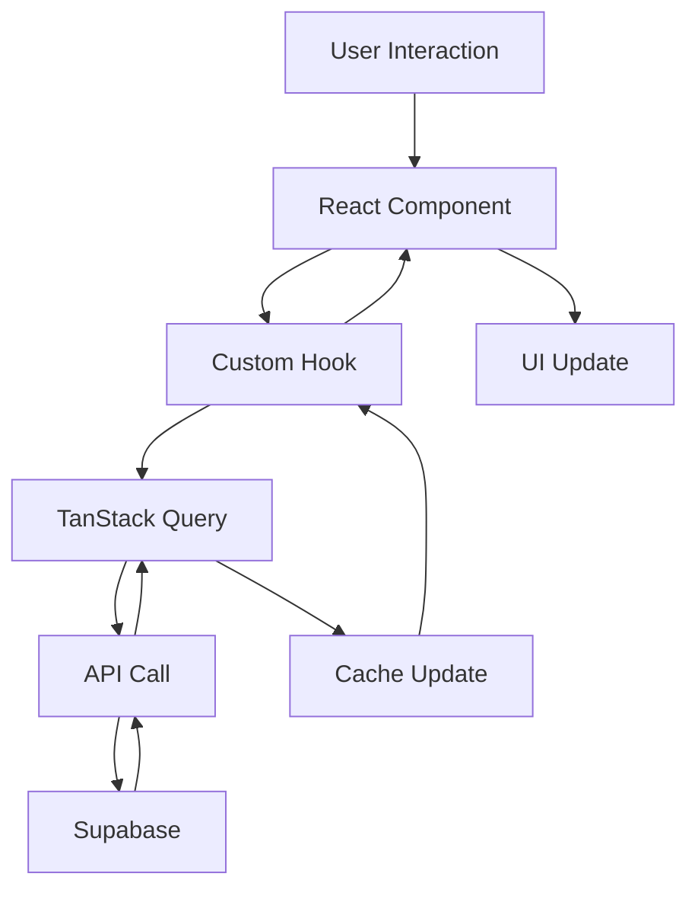
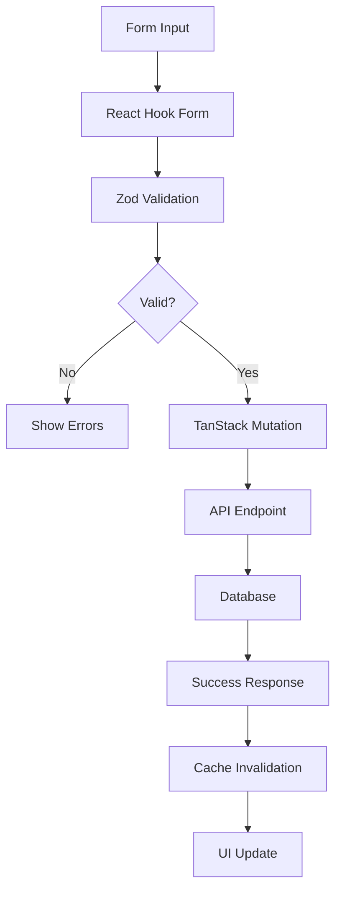
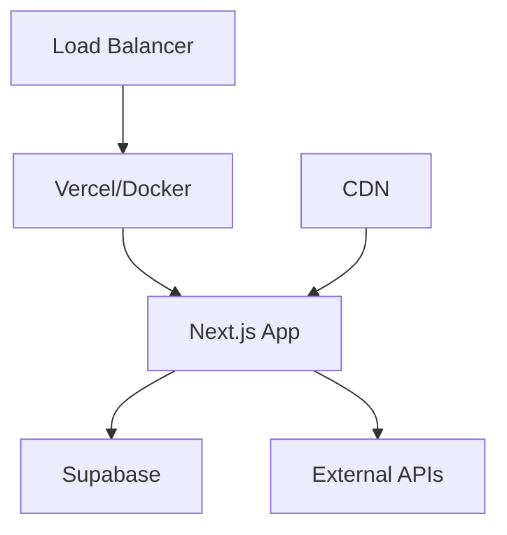

# FormDee Architecture

This document outlines the architectural decisions, patterns, and system design of FormDee.

## 🏗️ System Overview

FormDee is a modern, type-safe form builder built with React and Next.js, emphasizing performance, developer experience, and maintainability.

### Core Principles

1. **TypeScript First**: Comprehensive type safety with zero `any` types
2. **Performance Optimized**: Intelligent caching and minimal re-renders
3. **Developer Experience**: Clear patterns and excellent tooling
4. **Accessibility**: WCAG compliant and keyboard accessible
5. **Maintainable**: Clean architecture with well-defined boundaries

## 📋 Tech Stack

### Current Stack (v2.0+)

| Layer             | Technology                | Purpose                              |
| ----------------- | ------------------------- | ------------------------------------ |
| **Framework**     | Next.js 14 (App Router)   | Full-stack React framework           |
| **Language**      | TypeScript 5.0+           | Type safety and developer experience |
| **UI Library**    | Ant Design (AntD)         | Component library                    |
| **Styling**       | Tailwind CSS              | Utility-first CSS                    |
| **Forms**         | React Hook Form + Zod     | Form state and validation            |
| **Data Fetching** | TanStack Query            | Server state management              |
| **Database**      | Supabase (PostgreSQL)     | Database and authentication          |
| **Drag & Drop**   | hello-pangea/dnd          | Drag and drop functionality          |
| **Testing**       | Vitest + RTL + Playwright | Unit, integration, and E2E tests     |

## 🏛️ Architecture Layers

### 1. Presentation Layer

**Components Structure:**

```
components/
├── forms/          # Form-specific components
├── ui/             # Reusable UI components
├── layout/         # Layout components
└── providers/      # React context providers
```

**Responsibilities:**

- User interface rendering
- User interaction handling
- Accessibility implementation
- Visual feedback and loading states

### 2. Business Logic Layer

**Hooks Structure:**

```
hooks/
├── useAuth.ts      # Authentication logic
├── useForms.ts     # Form CRUD operations
├── useResponses.ts # Response management
└── useSettings.ts  # Application settings
```

**Responsibilities:**

- Business rules implementation
- Data transformation
- State management
- API integration

### 3. Data Layer

**API Structure:**

```
app/api/
├── auth/           # Authentication endpoints
├── forms/          # Form CRUD operations
├── responses/      # Response management
└── settings/       # Application settings
```

**Responsibilities:**

- Data persistence
- API endpoints
- Database operations
- External service integration

## 🔄 Data Flow Architecture

### Client-Side Data Flow



### Form Processing Flow



## 📐 Design Patterns

### 1. Forms Pattern

**Standard Implementation:**

```typescript
// 1. Define Zod schema
const contactSchema = z.object({
  name: z.string().min(1, "Name required"),
  email: z.string().email("Invalid email"),
  message: z.string().min(10, "Message too short")
})

// 2. Infer TypeScript type
type ContactFormData = z.infer<typeof contactSchema>

// 3. Use React Hook Form
export function ContactForm() {
  const form = useForm<ContactFormData>({
    resolver: zodResolver(contactSchema),
    defaultValues: { name: "", email: "", message: "" }
  })

  const submitMutation = useSubmitContact()

  return (
    <Form {...form}>
      <form onSubmit={form.handleSubmit(submitMutation.mutate)}>
        {/* Form fields */}
      </form>
    </Form>
  )
}
```

### 2. Data Fetching Pattern

**Query Implementation:**

```typescript
// Query key factory
export const queryKeys = {
  contacts: {
    all: ['contacts'] as const,
    list: (filters?: ContactFilters) => ['contacts', 'list', filters] as const,
    detail: (id: string) => ['contacts', 'detail', id] as const,
  },
}

// Query hook
export function useContacts(filters?: ContactFilters) {
  return useQuery({
    queryKey: queryKeys.contacts.list(filters),
    queryFn: () => contactsApi.getAll(filters),
    staleTime: 1000 * 60 * 5, // 5 minutes
  })
}

// Mutation hook
export function useCreateContact() {
  const queryClient = useQueryClient()

  return useMutation({
    mutationFn: contactsApi.create,
    onSuccess: () => {
      queryClient.invalidateQueries({
        queryKey: queryKeys.contacts.all,
      })
    },
  })
}
```

### 3. Component Composition Pattern

**Reusable Component Structure:**

```typescript
interface BaseComponentProps {
  className?: string
  children?: React.ReactNode
}

interface SpecificComponentProps extends BaseComponentProps {
  title: string
  onAction: () => void
}

export function ReusableComponent({
  title,
  onAction,
  className,
  children
}: SpecificComponentProps) {
  return (
    <Card className={cn("default-styles", className)}>
      <CardHeader>
        <CardTitle>{title}</CardTitle>
      </CardHeader>
      <CardContent>
        {children}
      </CardContent>
      <CardFooter>
        <Button onClick={onAction}>Action</Button>
      </CardFooter>
    </Card>
  )
}
```

## 🗃️ State Management Strategy

### Server State (TanStack Query)

**Used for:**

- API data fetching
- Caching and synchronization
- Background updates
- Optimistic updates

**Configuration:**

```typescript
const queryClient = new QueryClient({
  defaultOptions: {
    queries: {
      staleTime: 1000 * 60 * 5, // 5 minutes
      gcTime: 1000 * 60 * 30, // 30 minutes
      retry: 3,
      refetchOnWindowFocus: false,
    },
    mutations: {
      retry: 1,
    },
  },
})
```

### Client State (React Hooks)

**Used for:**

- UI state (modals, tabs, loading states)
- Form state (React Hook Form)
- Component-local state
- Theme and preferences

**Guidelines:**

- Use `useState` for simple state
- Use `useReducer` for complex state logic
- Use `useContext` sparingly for truly global UI state
- Avoid prop drilling with component composition

### Form State (React Hook Form)

**Used for:**

- All form input handling
- Validation state
- Form submission state
- Field-level state management

## 🔌 API Design

### RESTful Endpoints

```typescript
// Forms API
GET    /api/forms                 # List forms
GET    /api/forms/[id]           # Get form
POST   /api/forms                # Create form
PUT    /api/forms/[id]           # Update form
DELETE /api/forms/[id]           # Delete form

// Responses API
GET    /api/responses            # List responses
POST   /api/responses            # Submit response
GET    /api/responses/[id]       # Get response

// Auth API
POST   /api/auth/login           # Login
POST   /api/auth/logout          # Logout
GET    /api/auth/me              # Get current user
```

### Error Handling

**Standard Error Response:**

```typescript
interface ApiError {
  code: string
  message: string
  details?: unknown
  timestamp: string
}

// Example usage
try {
  const data = await api.getForms()
  return data
} catch (error) {
  if (error instanceof ApiError) {
    toast.error(error.message)
  } else {
    toast.error('An unexpected error occurred')
  }
  throw error
}
```

## 🧪 Testing Strategy

### Testing Pyramid

1. **Unit Tests (70%)**
   - Component logic
   - Hook functionality
   - Utility functions
   - Validation schemas

2. **Integration Tests (20%)**
   - API endpoints
   - Hook + API integration
   - Component + hook integration

3. **E2E Tests (10%)**
   - Critical user flows
   - Form submission
   - Authentication flow

### Testing Tools

- **Vitest**: Unit test runner
- **React Testing Library**: Component testing
- **MSW**: API mocking
- **Playwright**: E2E testing

## 🔒 Security Considerations

### Authentication & Authorization

- **JWT tokens** for stateless authentication
- **Role-based access control** for admin features
- **Secure cookie storage** for session management
- **CSRF protection** for form submissions

### Data Validation

- **Client-side validation** with Zod for UX
- **Server-side validation** for security
- **Input sanitization** to prevent XSS
- **SQL injection protection** via Supabase RLS

### File Uploads

- **File type validation** on client and server
- **File size limits** to prevent abuse
- **Secure file storage** with proper permissions
- **Malware scanning** for uploaded files

## 📊 Performance Optimizations

### Caching Strategy

1. **Query Caching**: TanStack Query with smart invalidation
2. **Static Assets**: Next.js automatic optimization
3. **Database**: Supabase connection pooling
4. **CDN**: Static file delivery optimization

### Bundle Optimization

1. **Code Splitting**: Automatic route-based splitting
2. **Tree Shaking**: Unused code elimination
3. **Dynamic Imports**: Lazy loading of heavy components
4. **Bundle Analysis**: Regular size monitoring

### Runtime Performance

1. **React.memo**: Prevent unnecessary re-renders
2. **useMemo/useCallback**: Expensive computation caching
3. **Virtual Scrolling**: Large list optimization
4. **Image Optimization**: Next.js image component

## 🚀 Deployment Architecture

### Production Environment



### Environment Configuration

- **Development**: Local development with hot reload
- **Staging**: Production-like environment for testing
- **Production**: Optimized build with monitoring

## 📋 Deprecated & Removed

### ❌ Deprecated Patterns (Do Not Use)

1. **Custom validation utilities** → **Use Zod schemas**

   ```typescript
   // ❌ Old way
   const validateEmail = (email: string) => {
     const regex = /^[^\s@]+@[^\s@]+\.[^\s@]+$/
     return regex.test(email)
   }

   // ✅ New way
   const emailSchema = z.string().email('Invalid email')
   ```

2. **Manual form state management** → **Use React Hook Form**

   ```typescript
   // ❌ Old way
   const [formData, setFormData] = useState({})
   const [errors, setErrors] = useState({})

   // ✅ New way
   const form = useForm({
     resolver: zodResolver(schema),
   })
   ```

3. **Custom fetch wrappers** → **Use TanStack Query**

   ```typescript
   // ❌ Old way
   const [data, setData] = useState(null)
   const [loading, setLoading] = useState(false)

   useEffect(() => {
     setLoading(true)
     fetchData()
       .then(setData)
       .finally(() => setLoading(false))
   }, [])

   // ✅ New way
   const { data, isLoading } = useQuery({
     queryKey: ['data'],
     queryFn: fetchData,
   })
   ```

4. **HTML5 drag and drop API** → **Use hello-pangea/dnd**

   ```typescript
   // ❌ Old way
   <div
     draggable
     onDragStart={handleDragStart}
     onDragOver={handleDragOver}
   >

   // ✅ New way
   <DragDropContext onDragEnd={handleDragEnd}>
     <Droppable droppableId="list">
       {(provided) => (
         <div {...provided.droppableProps} ref={provided.innerRef}>
           <Draggable draggableId="item" index={0}>
             {(provided) => (
               <div {...provided.draggableProps} {...provided.dragHandleProps}>
   ```

5. **Component naming with suffixes** → **Use canonical names**

   ```typescript
   // ❌ Old naming
   FormRendererAntd.tsx
   UserListQuery.tsx
   ContactFormHookForm.tsx

   // ✅ New naming
   FormRenderer.tsx
   UserList.tsx
   ContactForm.tsx
   ```

6. **Global loading/error states** → **Use Query status**

   ```typescript
   // ❌ Old way
   const [globalLoading, setGlobalLoading] = useState(false)
   const [globalError, setGlobalError] = useState(null)

   // ✅ New way
   const { data, isLoading, error } = useQuery({
     queryKey: ['data'],
     queryFn: fetchData,
   })
   ```

### 🗂️ Removed Files/Patterns

The following were removed during modernization:

- **Custom validation utilities** in `lib/validation-old.ts`
- **Manual form components** with `useState` form handling
- **Custom fetch hooks** like `useFetch`, `useApi`
- **Redux/Zustand stores** for server state
- **Component variants** with library suffixes (`*Antd.tsx`, `*Query.tsx`)
- **Manual error boundaries** replaced with Query error handling
- **Custom loading spinners** replaced with Query loading states

### 🔄 Migration Guide

For existing code that needs updating:

1. **Forms**: Replace custom form logic with RHF + Zod
2. **Data Fetching**: Replace fetch hooks with TanStack Query
3. **Components**: Rename files to canonical names
4. **State**: Move server state to Query, keep UI state local
5. **Validation**: Replace custom validators with Zod schemas

## 🔮 Future Considerations

### Potential Additions

1. **Internationalization (i18n)**: Multi-language support
2. **Real-time Features**: WebSocket integration for live updates
3. **Advanced Analytics**: User behavior tracking
4. **Plugin System**: Extensible architecture for custom fields

### Technology Evaluation

We continuously evaluate new technologies while maintaining stability:

- **React Server Components**: For improved performance
- **Suspense**: For better loading states
- **Concurrent Features**: For smoother UX
- **New Testing Tools**: For better developer experience

## 📚 References

- [Architecture Decision Records](./DECISIONS/)
- [Contributing Guide](./CONTRIBUTING.md)
- [Frontend Standards](./docs/standards/frontend.md)
- [Testing Guide](./docs/testing.md)

---

This architecture document is living and evolves with the project. All changes should be documented and reviewed by the team.
